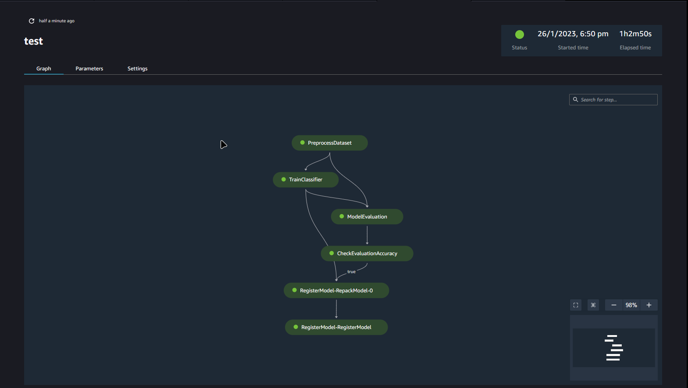
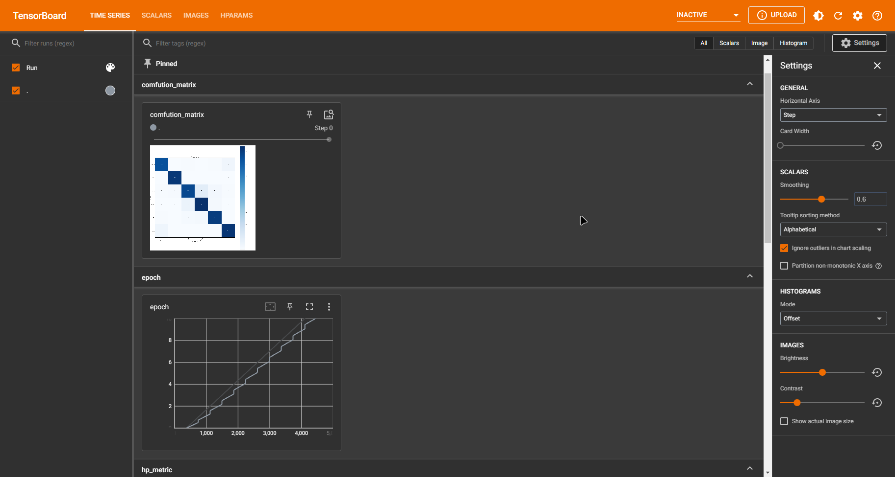
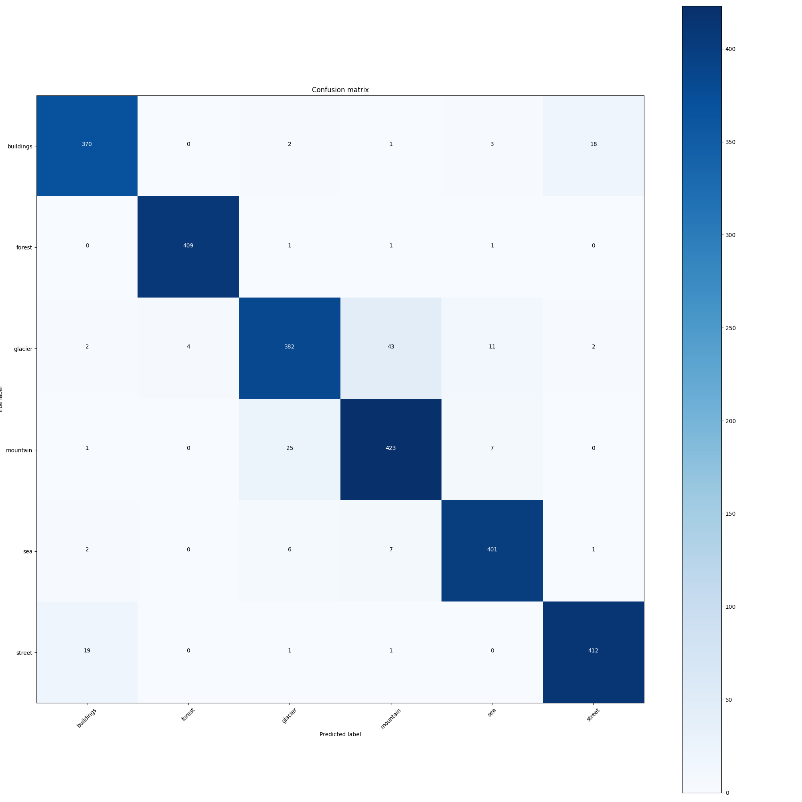

# AWS SageMaker

[project video](https://www.youtube.com/watch?v=IfmyDxgxcAw)


Logged Model Metrics:
  - F1 Score
  - Precision
  - Recall
  - Confusion Matrix (Can be Image in Tensorboard)

Create a complete SageMaker pipeline for:
  - Fetch Data → Preprocess → Train → Eval → Register Model (Conditional)

- Labeling with label studio
- Endpoint integartion with Label Studio for [ml supported labeling](https://github.com/BlackOpsV2/custom-label-studio-ml-backend)
- Label Studio Integartion with S3

---------------------

- Custom Docker Image

  <details>
  <summary><b>Dockerfile:</b></summary>

  ```Dockerfile
  FROM 763104351884.dkr.ecr.us-east-1.amazonaws.com/pytorch-training:1.12.1-gpu-py38-cu113-ubuntu20.04-sagemaker

  COPY requirements.txt .
  RUN pip3 install -r requirements.txt

  ```
- [preprocessing data script](preprocess.py), [training model script](train.py) & [infrencing script](infer.py)
- sagemaker notebooks [setup dvc and git](notebooks/01-setup-git-dvc.ipynb) | [building pipeline](notebooks/02-pipeline.ipynb)
- [tensorboard dev logs](https://tensorboard.dev/experiment/BxMWktWVTyuOoLOf9ydTPA/)
- Pipeline



```bash
model training

Epoch 11/11 ━━━━━━━━━━━━━━━━ 454/454 0:14:56 •        1.72it/s loss: 0.425      
                                     0:00:00                   v_num: 0         
                                                               val/loss: 0.223  
                                                               val/acc: 0.938   
                                                               val/acc_best: 0.945 
                                                               train/loss: 0.438 
                                                               train/acc: 0.817

model evaluation

:: Eval Metrices->  {
      "accuracy": {
          "value": 0.9322896003723145,
          "per_class_accuracy": {
              "buildings": 0.9291139245033264,
              "forest": 0.9951456189155579,
              "glacier": 0.8623024821281433,
              "mountain": 0.9208791255950928,
              "sea": 0.9641148447990417,
              "street": 0.9282407164573669
          },
          "standard_deviation": 0.04474925622344017
      },
      "loss": 0.24545598030090332,
      "f1_score": 0.9322896003723145,
      "precission_micro": 0.9322896003723145,
      "precission_macro": 0.9337800741195679,
      "precission_weighted": 0.932722806930542,
      "recall": 0.9322896003723145
  }
  confusion_matrix = 
     [[367,   1,   0,   1,   2,  24],
      [  0, 410,   0,   0,   2,   0],
      [  2,   3, 382,  53,   3,   0],
      [  0,   1,  30, 419,   4,   1],
      [  1,   0,   5,   8, 403,   1],
      [ 28,   3,   0,   0,   0, 401]]
```
[tensorboard logs](https://tensorboard.dev/experiment/jjSolIzpRtaHq8UX04bbAQ/#scalars)
  
  

Confusion Matrix for validation set

